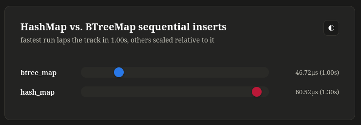

# cargo-balls

the only correct way to visualize anything.



## Example usage

```rust
use cargo_balls::balls_main;
use std::collections::{BTreeMap, HashMap};
use std::hint::black_box;

fn hash_map() {
    let mut map = HashMap::new();
    for i in 0..1000 {
        map.insert(i, i);
    }
    black_box(map);
}

fn btree_map() {
    let mut map = BTreeMap::new();
    for i in 0..1000 {
        map.insert(i, i);
    }
    black_box(map);
}

balls_main!(hash_map, btree_map);
```

```toml
[[bench]]
name = "example"
harness = false
```

## Configuration

Relative mode: fastest ball is moving in 1 second (can be overwritten), all others scaled relative to it.
Absolute mode: all balls move at the actual speeds of the functions they represent.

Its also possible to specify a title to be displayed in the HTML.

```rust
balls_main!(relative: Duration::from_secs(2); hash_map, btree_map);
```

```rust
balls_main!(absolute; hash_map, btree_map);
```

```rust
balls_main!(title: "map insert"; hash_map, btree_map);
balls_main!(title: "map insert", absolute; hash_map, btree_map);
```
